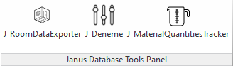
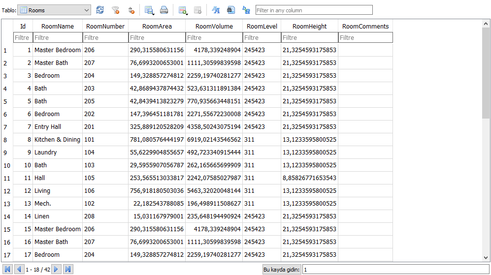

# Revit-DB-Tools
Tools for data collection, storage, retrieval, processing, and SQL integration

## Basic Explanation / Usage of Commands :

#### J_ROOMDATAREPORTER
-Function        : Query room data and insert into the SQLite db showing room names, numbers, areas, etc. \
-Purpose         : Database building for further autocompletion engine.

#### J_PARAMETERTRACKER -UNDER CONSRTUCTION-
-Function        : Records parameter changes in the SQLite database along with timestamps and other relevant information. \
-Purpose         : Database building for further autocompletion engine.

#### J_MATERIALQUANTITIESTRACKER  -UNDER CONSRTUCTION-
-Function        : Track material usage across model. Calculate total quantities used for each material. Output to SQLite db \
-Purpose         : Database building for further autocompletion engine.
